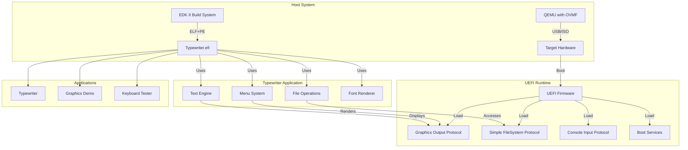
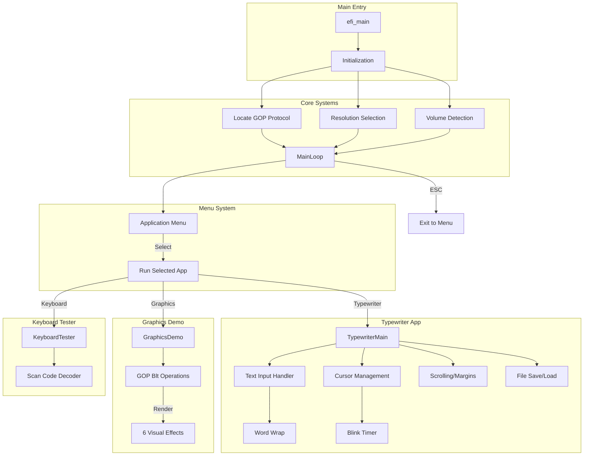
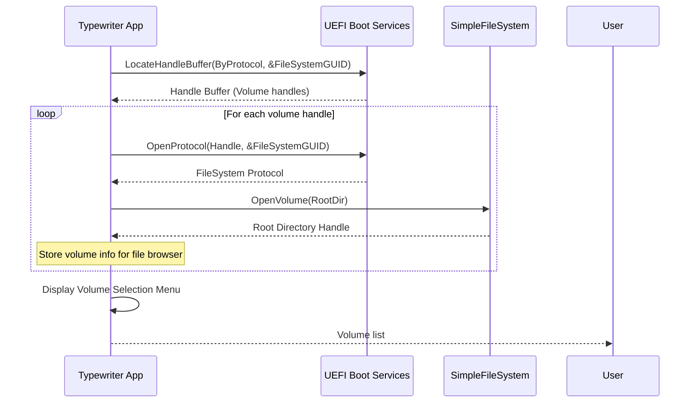
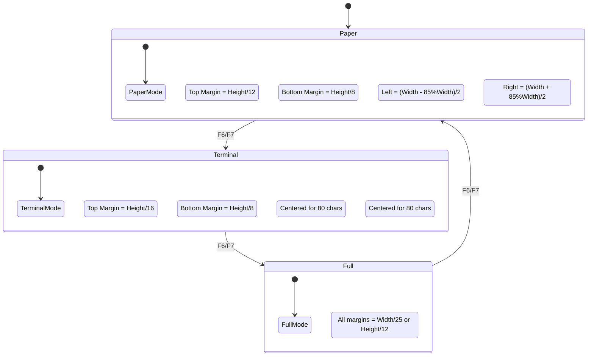

# Typewrite OS - Architecture Documentation

> **Context:** High-level repo orientation (buildable paths, doc index) is in [`AGENTS.md`](AGENTS.md).

## Overview

Typewrite OS is a native UEFI application designed to provide a minimalist typewriter experience with graphical menus and desk accessories. It runs directly on hardware from USB boot without requiring an operating system.

## System Architecture

### High-Level Component Diagram



## Disk Layout

### USB Boot Drive Structure

```
+----------------------------------------------------------+
|                    USB Drive Layout                      |
+----------------------------------------------------------+
|                                                          |
|  +------------------+                                    |
|  |  MBR/GPT Header  |  (446 bytes MBR or GPT header)    |
|  +------------------+                                    |
|  |                  |                                    |
|  |  EFI System      |  +----------------------------+   |
|  |  Partition       |  | /EFI/BOOT/                 |   |
|  |  (FAT12/16/32)  |  |    bootx64.efi             |   |
|  |                  |  |    Typewriter.efi         |   |
|  |                  |  |    startup.nsh            |   |
|  |                  |  +----------------------------+   |
|  |                  |                                    |
|  +------------------+                                    |
|                                                          |
|  +------------------+                                    |
|  |  Data Partition  |  (Optional - for saved files)    |
|  |  (FAT32)         |                                    |
|  +------------------+                                    |
|                                                          |
+----------------------------------------------------------+
```

### Detailed ASCII Diagram

```
USB Flash Drive (16GB Example)
=================================================================
 Sector 0         Sector 1-62       Sector 63      ...
+--------------+------------------+-------------+-----------------+
|   MBR (446)  |  Partition Table | Boot Sector |  FAT12/16/32   |
|              |    (64 bytes)    |             |  File System   |
+--------------+------------------+-------------+-----------------+
      |                |                  |              |
      |                |                  |              |
      v                v                  v              v
+-------------+------------------+------------------------+
| Boot Code   |  Part 1: EFI     |  Part 2: Data (opt)   |
| 0x55AA      |  Start: LBA 1    |  Start: LBA X         |
| 0xAA55      |  Type: EF (EFI)  |  Type: 0C (FAT32 LBA) |
+-------------+------------------+------------------------+
                                   |
                                   v
                         +----------------------+
                         | /EFI/BOOT/           |
                         |   bootx64.efi        |  <-- Fallback bootloader
                         |   bootx64.efi.bak    |
                         |                      |
                         | /typewrite/          |
                         |   Typewriter.efi     |  <-- Main application
                         |                      |
                         | /docs/               |
                         |   README.txt         |
                         +----------------------+
```

### GPT Partition Layout (Alternative)

```
+------------------------------------------------------------------+
|                        GPT Partition Layout                       |
+------------------------------------------------------------------+
|                                                                   |
|  LBA 0:        +-------------------------+                        |
|                | Protective MBR (1 sector) |                    |
|                +-------------------------+                        |
|                | GPT Header (1 sector)    |  LBA 1              |
|                +-------------------------+                        |
|                | GPT Partition Entry Array|  LBA 2-33            |
|                | (128 entries * 128 bytes)                       |
|                +-------------------------+                        |
|                                                                   |
|  LBA 34:      +-------------------------+                        |
|               | EFI System Partition    |                        |
|               | (FAT32, 100MB typical)  |                        |
|               | Mount Point: /boot/efi/ |                        |
|               +-------------------------+                        |
|                                                                   |
|               +-------------------------+                        |
|               | Data Partition          |                        |
|               | (Remaining space)       |                        |
|               | (FAT32 or ext4)         |                        |
|               +-------------------------+                        |
|                                                                   |
+------------------------------------------------------------------+
```

## Memory Layout

### UEFI Application Memory Map

```
+------------------------------------------------------------------+
|                     UEFI Runtime Memory Map                       |
+------------------------------------------------------------------+
|                                                                   |
|  0x00000000    +------------------------+                         |
|                | Real Mode IVT          |  Interrupt Vector      |
|  0x00000400    +------------------------+  BIOS Data Area        |
|                | BIOS Data Area         |                        |
|  0x00000500    +------------------------+  Conventional Memory  |
|                |                        |                        |
|                | Boot Loader Area       |                        |
|                |                        |                        |
|  0x000A0000    +------------------------+  Video Memory          |
|                | Video RAM (A0000-BFFFF)|  (VRAM)                |
|  0x000C0000    +------------------------+                        |
|                | BIOS ROM Area          |                        |
|                |                        |                        |
|  0x00100000    +------------------------+  OS/UEFI Loading       |
|                |                        |                        |
|                | UEFI Boot Services     |  <-- Typewriter.efi   |
|                | Code & Data            |      loads here       |
|                |                        |                        |
|  [varies]      +------------------------+                        |
|                | Runtime Services       |  Runtime memory       |
|                |                        |  (after ExitBS)       |
|                +------------------------+                        |
|                                                                   |
+------------------------------------------------------------------+
```

### Typewriter Application Memory Usage

```
Typewriter.efi Memory Layout (Typical)
=================================================================
                                                          |
0x100000 (1MB)  +------------------------+               |
                | Text Buffer            |               |
                | lineBuffer[500][200]   |  100,000 bytes|
                | CHAR16 = 2 bytes/char  |               |
                +------------------------+               |
                | Line Count Array       |               |
                | lineCharCount[500]     |  2,000 bytes  |
                +------------------------+               |
                | Menu/UI Buffers        |  ~50,000 bytes|
                +------------------------+               |
                | Font Data              |               |
                | FontData[512][16]      |  8,192 bytes  |
                +------------------------+               |
                | Stack                  |  ~64KB        |
                +------------------------+               |
                | Heap/Transient        |  Variable     |
                +------------------------+               |
                                                          |
Total ~200KB typical (excluding runtime allocations)
```

## Application Modules

### Module Architecture



### Font Rendering Pipeline

```
Character Rendering Flow
=================================================================

User Input ('A')    Font Lookup           Glyph Rendering
      |                  |                       |
      v                  v                       |
+------------+      +------------+        +-------------+
| Get CHAR16 | ---> | Find glyph |  --->  | Scale to    |
| character  |      | index:     |        | target size |
| value: 65  |      | 65 - 32    |        | (fontSize)  |
+------------+      | = 33       |        +-------------+
                    +------------+              |
                           |                    v
                           |            +-------------+
                           +----------> | GOP Blt()   |
                                        | Pixel Fill  |
                                        +-------------+
                                               |
                                               v
                                       +-------------+
                                       | Screen      |
                                       | Display     |
                                       +-------------+
```

## File System Operations

### Volume Detection Flow



### File Save Operation

```
SaveTextToFile() Execution Flow
=================================================================

1. Open Volume
   +------------------+
   | OpenVolume(Fs)   | --> EFI_FILE *Root
   +------------------+

2. Create/Overwrite File
   +---------------------------+
   | Root->Open(File, name,    |
   |   EFI_FILE_MODE_READ |   |
   |   EFI_FILE_MODE_WRITE|   |
   |   EFI_FILE_MODE_CREATE)  |
   +---------------------------+
               |
               v

3. Write Each Line
   +---------------------------+
   | For each line:            |
   |   - Convert CHAR16 to     |
   |     CHAR8 (ASCII)        |
   |   - File->Write(size,    |
   |     buffer)              |
   |   - Write CRLF (0x0D0A)  |
   +---------------------------+

4. Close File
   +---------------------------+
   | File->Close()             |
   | Root->Close()            |
   +---------------------------+
```

## Color System

### Background Color Palette

The application includes 10 background colors to support various display types:

| Index | Name      | RGB (BGR in UEFI) | Notes                          |
|-------|-----------|-------------------|--------------------------------|
| 0     | Green     | 0x1A4D26 (B:26 G:4D R:1A) | Classic phosphor green      |
| 1     | Black     | 0x000000 (B:00 G:00 R:00) | Pure black                   |
| 2     | Blue      | 0x003060 (B:60 G:30 R:00) | Appears brown on some QEMU  |
| 3     | Cyan      | 0x207080 (B:80 G:70 R:20) | Dark cyan variant            |
| 4     | Red       | 0x602020 (B:20 G:20 R:60) | Dark red variant             |
| 5     | Purple    | 0x503060 (B:60 G:30 R:50) | Retro purple                 |
| 6     | Gray      | 0x505050 (B:50 G:50 R:50) | Neutral gray                 |
| 7     | Navy      | 0x001040 (B:40 G:20 R:10) | Navy blue                    |
| 8     | Teal      | 0x306070 (B:70 G:60 R:30) | Dark teal                    |
| 9     | Burgundy  | 0x402030 (B:30 G:20 R:40) | Wine red                     |

**Note**: UEFI GOP uses BGR (Blue-Green-Red) pixel format, so RGB values are stored in reverse order.

## Keyboard Input

### Scan Code Reference

| Key         | Scan Code (hex) | Description                    |
|-------------|-----------------|--------------------------------|
| Up Arrow    | 0x01            | Navigate up                   |
| Down Arrow  | 0x02            | Navigate down                 |
| Right Arrow | 0x03            | Next item/cycle colors        |
| Left Arrow  | 0x04            | Previous item                 |
| Home        | 0x10            | Beginning of line             |
| End         | 0x17            | End of line                   |
| Page Up     | 0x0B            | Scroll up                     |
| Page Down   | 0x0C            | Scroll down                   |
| Escape      | 0x17            | Exit/Back (also 0x01 for Up) |
| F1          | 0x0B            | Toggle debug                  |
| F2          | 0x0C            | Increase font size            |
| F3          | 0x0D            | Decrease font size            |
| F4          | 0x0E            | Cycle background color        |
| F5          | 0x0F            | Toggle TrueType mode          |
| F6          | 0x10            | Cycle view mode               |
| F7          | 0x40            | Cycle view mode (alternate)  |

## View Modes

The application supports three view modes that control margin and text area rendering:



### View Mode Specifications

| Mode     | Aspect Ratio | Margins            | Use Case                    |
|----------|--------------|--------------------|-----------------------------|
| Paper    | 8.5:11       | Tight margins      | Document-style typing       |
| Terminal | 80x25        | Centered text     | Classic terminal emul.     |
| Full     | Maximized    | Minimal margins    | Full-screen editing        |

## Data Structures

### Line Buffer Structure

```c
// Text storage - 500 lines max, 200 chars per line
CHAR16 lineBuffer[MAX_LINES][MAX_LINE_LEN];  // 500 x 200 x 2 = 200KB
UINT32 lineCharCount[MAX_LINES];             // 500 x 4 = 2KB
```

### Volume Information Structure

```c
typedef struct {
    EFI_HANDLE Handle;                              // Device handle
    CHAR16 Name[64];                                // Volume label
    EFI_SIMPLE_FILE_SYSTEM_PROTOCOL *Fs;           // Filesystem protocol
} VOLUME_INFO;
```

### Mode Information Structure

```c
typedef struct {
    UINT32 Mode;            // GOP mode number
    UINT32 Width;           // Horizontal resolution
    UINT32 Height;          // Vertical resolution  
    UINT32 PixelFormat;     // GOP pixel format enum
} MODE_INFO;
```

## Build System

### Build Flow

```
Source Code          EDK II Build           Output
---------           --------------         ------

Typewriter.c   -->   [Compile]        -->   Typewriter.obj
                         |
                         v
Typewriter.inf -->   [Link/Convert]  -->   Typewriter.efi
                         |
                         v
HelloWorld.dsc -->   [Package]       -->   Build/HelloWorld/...
                             
```

### EDK II DSC Configuration

```
[Defines]
  PLATFORM_NAME = HelloWorld
  DSC_SPECIFICATION = 0x00010005
  OUTPUT_DIRECTORY = Build/HelloWorld
  SUPPORTED_ARCHITECTURES = X64
  BUILD_TARGETS = DEBUG

[Components]
  apps/Typewriter/Typewriter.inf
  apps/GraphicsTest/GraphicsTest.inf
```

## Testing

### QEMU Testing Environment

```
Host Machine                QEMU Virtual Machine
---------                   --------------------

+----------+               +-------------------+
| EDK II   | -- compile -->| QEMU/OVMF         |
| Source   |               | +---------------+ |
+----------+               | | UEFI Firmware | |
                           | +---------------+ |
+----------+               |    |             |
| Typewriter| -- copy -->  |    v             |
| .efi     |               | +---------------+ |
+----------+               | | Typewriter    | |
                           | | .efi runs     | |
                           | +---------------+ |
                           +-------------------+
```

## Appendix: Key Constants

```c
#define MAX_LINES 500          // Maximum number of text lines
#define MAX_LINE_LEN 200       // Maximum characters per line
#define NUM_FONT_SIZES 10      // Available font sizes
#define NUM_BG_COLORS 10        // Available background colors
#define MAX_MODES 20            // GOP video modes to track
#define MAX_VOLUMES 10          // Filesystem volumes to track
```
