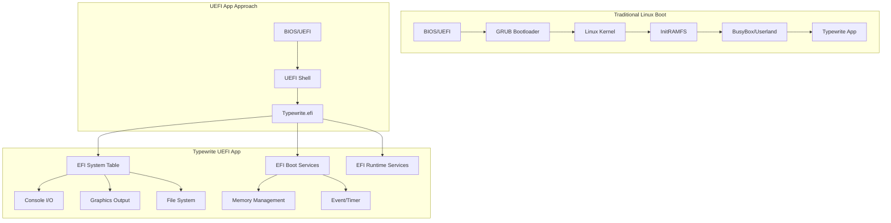
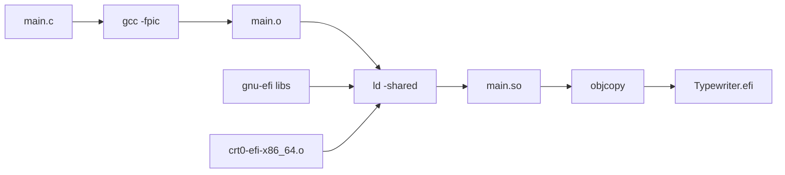
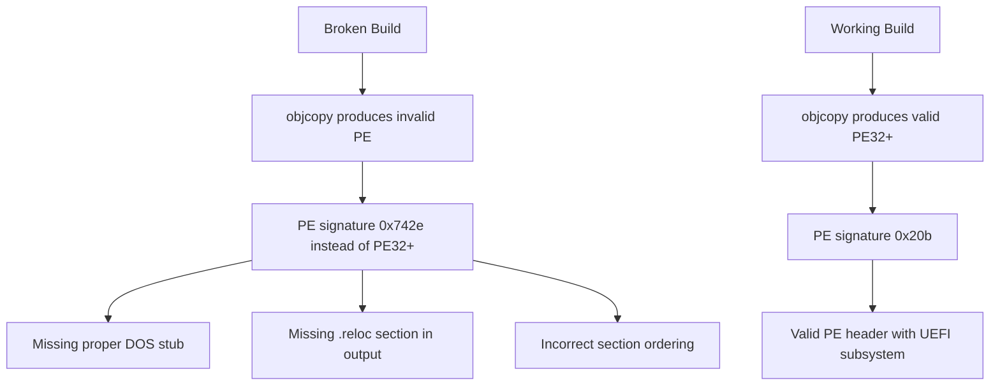

# Typewrite OS - Build System Documentation

## Overview

Typewrite OS is built as a native UEFI application using gnu-efi. This document details the build system, troubleshooting, and known issues.

## Architecture



## Build Flow



## Build Requirements

- **gnu-efi** 3.0.18+ (located at `/ironwolf4TB/data01/projects/gnu-efi`)
- **gcc** with x86_64 target
- **binutils** 2.38+ (specifically ld and objcopy)
- **QEMU** with OVMF firmware for testing

## Build Commands

```bash
cd uefi-app
make          # Builds Typewriter.efi
make clean    # Clean build artifacts
```

## The Critical Fix: Making objcopy Work Correctly

This section documents the key issue that was discovered and fixed.

### The Problem

Early builds produced an EFI app that QEMU rejected with:
```
Script Error Status: Unsupported (line number 1)
```

### Root Cause Analysis



### Detailed Investigation

#### Binary Comparison

| Property | Working (23KB) | Broken (83KB) | Fixed (84KB) |
|----------|---------------|---------------|--------------|
| PE Signature | 0x20b (PE32+) | 0x742e (invalid) | 0x20b (PE32+) |
| File type | PE32+ executable | PE Unknown | PE32+ executable |
| DOS Stub | All zeros | "This program cannot..." | All zeros |
| Sections | 3 (.text,.data,.reloc) | 6+ | 3+ |

#### Key Differences in Build

**Broken Makefile:**
```makefile
LDFLAGS = -nostdlib -znocombreloc -T $(EFI_LDS) -shared -Bsymbolic
objcopy -j .text -j .sdata -j .data -j .rodata -j .dynamic -j .dynsym -j .rel -j .rela -j .reloc -O efi-app-x86_64 $< $@
```

**Working Makefile:**
```makefile
LDFLAGS = -nostdlib --warn-common --no-undefined --fatal-warnings \
          --build-id=sha1 -z nocombreloc -shared -Bsymbolic \
          -L$(LIB) -L$(EFILIB) -T $(EFI_LDS)

objcopy -j .text -j .sdata -j .data -j .dynamic -j .rodata \
        -j .rel -j .rela -j .reloc --target efi-app-$(ARCH) $< $@
```

### Why This Matters

1. **Linker flags**: The extra flags (`--warn-common --no-undefined --fatal-warnings --build-id=sha1`) ensure the linker produces a properly structured ELF that objcopy can convert.

2. **--target vs -O**: Using `--target efi-app-x86_64` instead of `-O efi-app-x86_64` tells objcopy to use the correct target-specific relocation handling.

3. **Section selection**: Must include `.reloc` section for UEFI apps to work properly.

## PE Header Details

### Working Binary Header (xxd)
```
00000000: 4d5a 0000 0000 0000 0000 0000 0000 0000  MZ..............
00000010: 0000 0000 0000 0000 0000 0000 0000 0000  ................
...
00000080: 5045 0000 6486 0300 0000 0000 0000 0000  PE..d...........
```

- DOS header at 0x00 - mostly zeros (critical!)
- PE signature at 0x80
- Subsystem = 0x0a (UEFI application)

### Broken Binary Header (xxd)
```
00000000: 4d5a 9000 0300 0000 0400 0000 ffff 0000  MZ..............
...
00000040: 0e1f ba0e 00b4 09cd 21b8 014c cd21 5468  ........!..L.!Th
00000050: 6973 2070 726f 6772 616d 2063 616e 6e6f  is program canno
00000060: 7420 6265 2072 756e 2069 6e20 444f 5320  t be run in DOS 
```

- DOS stub contains "This program cannot be run in DOS mode" - WRONG for UEFI!

## Testing

### Running in QEMU

```bash
./start-qemu.sh
```

Or manually:
```bash
qemu-system-x86_64 \
    -bios /usr/share/ovmf/OVMF.fd \
    -drive if=pflash,format=raw,readonly=on,file=/usr/share/ovmf/OVMF.fd \
    -drive if=pflash,format=raw,file=ovmf_vars.fd \
    -drive format=raw,file=fat:rw:uefi-app/fs \
    -m 256M \
    -net none \
    -serial file:uefi-app/serial.log
```

### Expected Output

Working build shows:
```
Typewriter.efi

========================================
  Typewrite OS v1.0
  UEFI Typewriter Application
  Virgil & Helvetica Fonts
========================================

Resolution: 1024x768
```

Broken build shows:
```
test.efi
Script Error Status: Unsupported (line number 1)
```

## Common Issues and Solutions

### Issue: "Script Error Status: Unsupported"

**Cause**: Invalid PE header in the .efi file

**Solution**: 
1. Ensure Makefile uses `--target` not `-O` for objcopy
2. Verify PE signature is 0x20b (PE32+)
3. Check DOS stub is zeros, not DOS message

### Issue: Binary too large

**Cause**: Including debug info or unnecessary sections

**Solution**: Use `-g0` flag or strip debug info

### Issue: QEMU doesn't boot

**Cause**: FAT filesystem not properly formatted

**Solution**: Ensure startup.nsh exists in fs/ root

## File Structure

```
uefi-app/
├── Makefile          # Build system (FIXED)
├── main.c            # Source code
├── main.o            # Compiled object
├── main.so           # Linked shared object
├── Typewriter.efi   # Final EFI app (84KB)
├── virgil.h         # Virgil font data
├── helvetica.h      # Helvetica font data
├── fs/              # FAT filesystem for QEMU
│   ├── Typewriter.efi
│   └── startup.nsh
```

## References

- [Rod Smith's EFI Programming Guide](http://www.rodsbooks.com/efi-programming/)
- [OSDev Wiki - GNU-EFI](https://wiki.osdev.org/GNU-EFI)
- [GNU-EFI GitHub](https://github.com/pbatard/gnu-efi)
- [PE/COFF Specification](https://learn.microsoft.com/en-us/windows/win32/debug/pe-format)

## Changelog

- **2026-03-28**: Fixed Makefile to produce valid PE32+ by using correct linker flags and objcopy --target option
