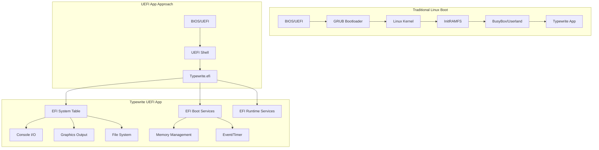
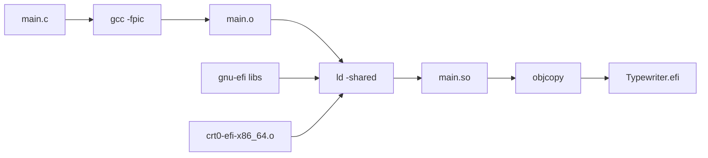
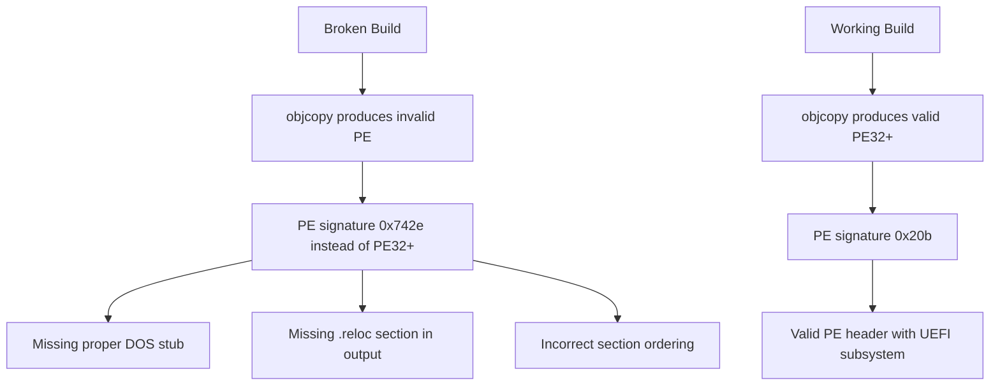

# Typewrite OS - Build System Documentation

> **Context:** For a short repo overview (UEFI vs Buildroot, open issues, doc index), read [`AGENTS.md`](AGENTS.md).

## Overview

Typewrite OS is built as a native UEFI application using gnu-efi. This document details the build system, troubleshooting, and known issues.

## Architecture



## Build Flow



## Build Requirements

- **gnu-efi** 3.0.18+ (clone beside the repo: `../gnu-efi` by default, or set `EFIDIR` — see `uefi-app/Makefile`)
- **gcc** with x86_64 target
- **binutils** 2.38+ (specifically ld and objcopy)
- **QEMU** with OVMF firmware for testing

## Build Commands

```bash
cd uefi-app
make          # Builds Typewriter.efi
make clean    # Clean build artifacts
```

## The Critical Fix: Making objcopy Work Correctly

This section documents the key issue that was discovered and fixed.

### The Problem

Early builds produced an EFI app that QEMU rejected with:
```
Script Error Status: Unsupported (line number 1)
```

### Root Cause Analysis



### Detailed Investigation

#### Binary Comparison

| Property | Working (23KB) | Broken (83KB) | Fixed (84KB) |
|----------|---------------|---------------|--------------|
| PE Signature | 0x20b (PE32+) | 0x742e (invalid) | 0x20b (PE32+) |
| File type | PE32+ executable | PE Unknown | PE32+ executable |
| DOS Stub | All zeros | "This program cannot..." | All zeros |
| Sections | 3 (.text,.data,.reloc) | 6+ | 3+ |

#### Key Differences in Build

**Broken Makefile:**
```makefile
LDFLAGS = -nostdlib -znocombreloc -T $(EFI_LDS) -shared -Bsymbolic
objcopy -j .text -j .sdata -j .data -j .rodata -j .dynamic -j .dynsym -j .rel -j .rela -j .reloc -O efi-app-x86_64 $< $@
```

**Working Makefile:**
```makefile
LDFLAGS = -nostdlib --warn-common --no-undefined --fatal-warnings \
          --build-id=sha1 -z nocombreloc -shared -Bsymbolic \
          -L$(LIB) -L$(EFILIB) -T $(EFI_LDS)

objcopy -j .text -j .sdata -j .data -j .dynamic -j .rodata \
        -j .rel -j .rela -j .reloc --target efi-app-$(ARCH) $< $@
```

### Why This Matters

1. **Linker flags**: The extra flags (`--warn-common --no-undefined --fatal-warnings --build-id=sha1`) ensure the linker produces a properly structured ELF that objcopy can convert.

2. **--target vs -O**: Using `--target efi-app-x86_64` instead of `-O efi-app-x86_64` tells objcopy to use the correct target-specific relocation handling.

3. **Section selection**: Must include `.reloc` section for UEFI apps to work properly.

## PE Header Details

### Working Binary Header (xxd)
```
00000000: 4d5a 0000 0000 0000 0000 0000 0000 0000  MZ..............
00000010: 0000 0000 0000 0000 0000 0000 0000 0000  ................
...
00000080: 5045 0000 6486 0300 0000 0000 0000 0000  PE..d...........
```

- DOS header at 0x00 - mostly zeros (critical!)
- PE signature at 0x80
- Subsystem = 0x0a (UEFI application)

### Broken Binary Header (xxd)
```
00000000: 4d5a 9000 0300 0000 0400 0000 ffff 0000  MZ..............
...
00000040: 0e1f ba0e 00b4 09cd 21b8 014c cd21 5468  ........!..L.!Th
00000050: 6973 2070 726f 6772 616d 2063 616e 6e6f  is program canno
00000060: 7420 6265 2072 756e 2069 6e20 444f 5320  t be run in DOS 
```

- DOS stub contains "This program cannot be run in DOS mode" - WRONG for UEFI!

## Testing

### QEMU: `start-qemu.sh` (recommended)

From the **repository root**, run:

```bash
./start-qemu.sh
```

The script:

1. Runs **`make -C uefi-app all`** (builds `uefi-app/Typewriter.efi`; avoids auto-commit; from **`uefi-app/`**, bare **`make`** commits+pushes when the tree changes).
2. **Copies** that binary to **`uefi-app/fs/Typewriter.efi`** so QEMU’s synthetic FAT drive always matches the latest build.
3. Ensures **`uefi-app/fs/startup.nsh`** exists (runs `Typewriter.efi` automatically in the UEFI Shell).
4. Picks **OVMF** from common distro paths (`/usr/share/OVMF/OVMF_CODE.fd`, `/usr/share/qemu/OVMF_CODE.fd`, or `/usr/share/ovmf/OVMF.fd`), or uses **`OVMF_CODE`** if set.
5. Keeps writable NVRAM in **`ovmf_vars.fd`** at the repo root (initialized from `/usr/share/OVMF/OVMF_VARS.fd` when available, otherwise copied from the combined `OVMF.fd`).

Options and environment:

| Flag / variable | Meaning |
|-----------------|--------|
| `--no-build` | Skip `make`; use existing `uefi-app/Typewriter.efi`. |
| `--fresh-vars` | Delete `ovmf_vars.fd` and recreate from the template (reset UEFI NVRAM / boot entries). |
| `--serial-stdio` | Guest serial (COM1) on **this terminal** instead of `uefi-app/serial.log`. |
| `--sdl` | Use **SDL** for the window (try this if GTK seems stuck or stays black). |
| `OVMF_CODE` | Absolute path to the read-only OVMF code image. |
| `QEMU_DISPLAY` | Passed to QEMU `-display`. Default is **`gtk,gl=off`** (plain `gtk` is upgraded unless `QEMU_GTK_GL=1`). |
| `QEMU_GTK_GL` | Set to `1` to use GTK with OpenGL (`gtk` or `gtk,gl=on`). |
| `QEMU_MACHINE` | Full `-machine` string. Default is **`q35`** + auto accel (KVM if `/dev/kvm` ok, else TCG). Empty uses QEMU’s default PC: `QEMU_MACHINE= ./start-qemu.sh` |
| `QEMU_ACCEL` | Passed as `-accel` inside default machine (`kvm:tcg`, `tcg`, …). Overrides KVM/TCG auto-detection. |

Full CLI reference: **`./start-qemu.sh --help`** (name, synopsis, options, env, files, examples).

**Packages (Debian/Ubuntu):** `sudo apt install qemu-system-x86 ovmf` (install **`qemu-system-gui`** too if GTK/SDL modules are missing).

**Serial log:** `uefi-app/serial.log` by default, or **`--serial-stdio`** to watch firmware and `Print()` in the terminal.

**Display:** With GTK, use **Ctrl+Alt+G** to grab the mouse and **Ctrl+Alt** to release.

### QEMU window hangs, black screen, or “Guest has not initialized the display (yet)”

That **title-bar message is normal** for several seconds while OVMF starts; it is not always a hang.

If the **window stays blank** or **never seems to finish “display init”**:

1. Run **`./start-qemu.sh --sdl`** — SDL avoids many GTK + OpenGL / Wayland issues.
2. The script defaults to **`gtk,gl=off`**. If you forced GL (`QEMU_GTK_GL=1`) and see problems, turn it off again.
3. Run **`./start-qemu.sh --serial-stdio`** — you should see TianoCore / shell / `Print()` output on the terminal even when the GUI is black. Confirms the guest is running.
4. On **Wayland**, try forcing X11 for GTK: **`GDK_BACKEND=x11 ./start-qemu.sh`**
5. Ensure **`qemu-system-gui`** (or your distro’s equivalent) is installed so the GTK/SDL UI modules load.

The script uses **`-machine q35,accel=…`** by default (better match for UEFI + GOP than older i440fx defaults). The accelerator is chosen automatically:

- **KVM** (`kvm:tcg`) when **`/dev/kvm`** is readable and writable (you are in the **`kvm`** group or permissions allow it).
- Otherwise **TCG** (software emulation) only — slower, but no “Permission denied” on KVM.

To use hardware acceleration after seeing the TCG note:

```bash
sudo usermod -aG kvm "$USER"
# then log out completely and back in (or reboot)
```

Verify: `groups` should list `kvm`, and `test -r /dev/kvm && test -w /dev/kvm && echo ok`.

Override: **`QEMU_ACCEL=tcg`** forces software emulation; **`QEMU_ACCEL=kvm:tcg`** forces KVM (fails if permissions are wrong).

### Manual QEMU command (equivalent layout)

Do **not** pass both `-bios` and OVMF `pflash` for the same image (redundant / confusing). Typical layout:

```bash
qemu-system-x86_64 \
    -machine q35,accel=kvm:tcg   # use accel=tcg if no access to /dev/kvm
    -drive if=pflash,format=raw,readonly=on,file=/usr/share/OVMF/OVMF_CODE.fd \
    -drive if=pflash,format=raw,file=ovmf_vars.fd \
    -drive format=raw,file=fat:rw:uefi-app/fs \
    -m 256M \
    -net none \
    -display gtk,gl=off \
    -serial file:uefi-app/serial.log
```

Copy `uefi-app/Typewriter.efi` into `uefi-app/fs/` after each `make` if you launch QEMU by hand.

### Expected Output

Working build shows:
```
Typewriter.efi

========================================
  Typewrite OS v1.0
  UEFI Typewriter Application
  Virgil & Helvetica Fonts
========================================

Resolution: 1024x768
```

Broken build shows:
```
test.efi
Script Error Status: Unsupported (line number 1)
```

## Common Issues and Solutions

### Issue: "Script Error Status: Unsupported"

**Cause**: Invalid PE header in the .efi file

**Solution**: 
1. Ensure Makefile uses `--target` not `-O` for objcopy
2. Verify PE signature is 0x20b (PE32+)
3. Check DOS stub is zeros, not DOS message

### Issue: Binary too large

**Cause**: Including debug info or unnecessary sections

**Solution**: Use `-g0` flag or strip debug info

### Issue: QEMU doesn't boot

**Cause**: FAT filesystem not properly formatted

**Solution**: Ensure startup.nsh exists in fs/ root

## File Structure

```
uefi-app/
├── Makefile          # Build system (FIXED)
├── main.c            # Source code
├── main.o            # Compiled object
├── main.so           # Linked shared object
├── Typewriter.efi   # Final EFI app (84KB)
├── virgil.h         # Virgil font data
├── helvetica.h      # Helvetica font data
├── fs/              # FAT filesystem for QEMU
│   ├── Typewriter.efi
│   └── startup.nsh
```

## References

- [Rod Smith's EFI Programming Guide](http://www.rodsbooks.com/efi-programming/)
- [OSDev Wiki - GNU-EFI](https://wiki.osdev.org/GNU-EFI)
- [GNU-EFI GitHub](https://github.com/pbatard/gnu-efi)
- [PE/COFF Specification](https://learn.microsoft.com/en-us/windows/win32/debug/pe-format)

## Changelog

- **2026-03-29**: **`start-qemu.sh`**: pick **KVM vs TCG** from **`/dev/kvm`** permissions (avoids KVM permission errors); **`QEMU_ACCEL`** override; **BUILD_SYSTEM.md** KVM group instructions.
- **2026-03-29**: **`start-qemu.sh`**: default **`-machine q35`** + accel, default GTK **`gl=off`**, **`--sdl`** and **`--serial-stdio`**, pre-launch tips; **BUILD_SYSTEM.md** QEMU display troubleshooting.
- **2026-03-29**: Removed redundant tracked **`buildroot.tar.gz`** (vendored tree remains under `buildroot-2024.02/`); local Buildroot **`output/`**, **`dl/`**, etc. are still safe to delete when present — they are build products, not source.
- **2026-03-29**: [`start-qemu.sh`](start-qemu.sh) **`--help`** documents behavior, paths, requirements, and examples; script builds `uefi-app`, syncs `Typewriter.efi` into `uefi-app/fs/`, auto-detects OVMF, drops duplicate `-bios`.
- **2026-03-29**: Added [`AGENTS.md`](AGENTS.md) and [`agent.md`](agent.md) pointers for return-to-context; root [`README.md`](README.md) and [`PROJECT_STATUS.md`](PROJECT_STATUS.md) updated for dual-track (UEFI + Buildroot) state.
- **2026-03-28**: Fixed Makefile to produce valid PE32+ by using correct linker flags and objcopy --target option
