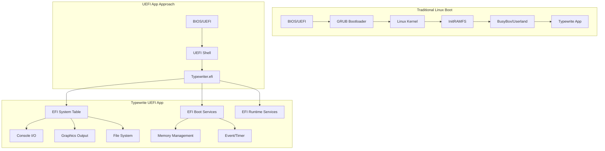
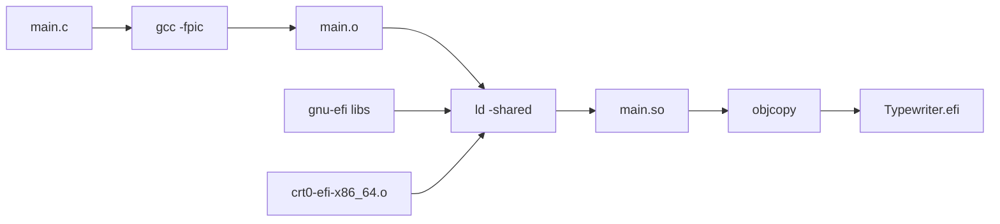

# Typewrite OS — UEFI application

Native **UEFI** build of Typewrite: boots without Linux, talks to **GOP**, **ConIn**, and firmware services via gnu-efi.

> **Build troubleshooting (PE32+, objcopy):** see [`../BUILD_SYSTEM.md`](../BUILD_SYSTEM.md).  
> **Framebuffer / hardware drawing issues:** see [`../GRAPHICS_DEBUG.md`](../GRAPHICS_DEBUG.md).  
> **Repo-wide context:** see [`../AGENTS.md`](../AGENTS.md).

## Architecture



## Build flow



## Build

```bash
cd uefi-app
make          # default: build, sync fs/Typewriter.efi, commit+push if uefi-app/ changed
make all      # compile only (no git); used by ../start-qemu.sh
make ship     # same as bare make
make clean    # remove objects and .efi (does not run git)
```

Optional: `make ship MSG="Short commit subject"` (default subject is `uefi-app: build Typewriter.efi`).

**gnu-efi location:** `Makefile` sets `EFIDIR` to **`$(repo)/../gnu-efi`** by default. Override with `export EFIDIR=...` or `make EFIDIR=...` if your tree is elsewhere.

For QEMU, run [`../start-qemu.sh`](../start-qemu.sh) from the repo root (it runs **`make -C uefi-app all`**, then copies **`Typewriter.efi`** into **`fs/`**). For USB/ESP, run [`../write-typewriter-to-usb.sh`](../write-typewriter-to-usb.sh) `/dev/sdX` (build + sync + installer), or call [`../install-uefi-app.sh`](../install-uefi-app.sh) directly if `uefi-app/fs/Typewriter.efi` is already up to date.

## Current status

### Working

- **Valid PE32+** UEFI application (firmware loads it; prior “Unsupported format” came from bad `objcopy`/link — fixed per `BUILD_SYSTEM.md`).
- **QEMU + OVMF** with FAT payload under `fs/` (e.g. `startup.nsh`).
- **GOP**: mode set, framebuffer base/pitch; large region fills verified on QEMU and some real hardware.
- **Bitmap fonts** from `fonts/convert_font.py`; **`Doc.Modified`** drives redraw (incremental row updates where possible; see [`../GRAPHICS_DEBUG.md`](../GRAPHICS_DEBUG.md)).
- **US Letter–style page**: fixed **50×60** character grid (**3000** cells), **~1"** margins at **96 logical DPI** (clamped on small displays), **black** outside the paper, centered horizontally. Column pitch is derived from the font so line length is consistent. **Vertical scroll** (`Doc.ScrollYPx`) keeps the caret in view when the scaled page is taller than the area above the status HUD.
- **Font scale**: **half-step** zoom (**1.0× … 6.0×**, stored as `FontScaleTwice` = 2…12).

### Open

- Retest **raw framebuffer** behavior on picky hardware; consider GOP **`Blt()`** if needed.
- Feature growth toward the behavior described in [`../FEATURES.md`](../FEATURES.md) (save/load, typewriter rules) — implemented incrementally in `main.c`.

## Keys (in the graphical editor)

| Key | Action |
|-----|--------|
| **F1** | Open / close **help / settings** (same idea as the X11 app): **↑/↓**, **Home/End**, **Space** or **Enter** to run the highlighted row. |
| **F2–F11** | When the menu is **closed**, same actions as in the menu (**F2** font, **F3** cursor, **F4** background, **F5** gutter, **F6** margins, **F7** chars/line, **F10** word wrap, **F9** status pulse interval, **F11** resolution). **F8** is unused (firmware may still deliver the scan code). |
| **ESC** | If **resolution confirm** is active: **revert** to the previous GOP mode. If the **menu** is open: close it. Otherwise **exit** the app (UEFI **SCAN_ESC** `0x0017`, not Up Arrow `0x0001`). |
| **← → ↑ ↓** | Move the **cursor** in the page grid (navigation only; does not open the menu). |
| **Home** / **End** | Start of line / after last non-space on the line (when the menu is closed). |
| **Insert** / **Delete** | Toggle **insert** vs **typeover** (default typeover); **delete forward** under the cursor. |
| **PgUp** / **PgDn** | **Previous** / **next** page (saves current page to slot files, same as menu items). |
| **Printable keys** | Type into the grid; **Enter** next row; **Backspace** / **Tab** as usual. **Word wrap** (default on, like X11): at end of line, text after the **last space** moves to the next row if that row is empty. |

### Settings menu rows (F1)

Aligned with **linux-typewrite-x11** where practical: **font**, **larger / smaller** scale, **background**, **cursor**, **key debug**, **gutter** (off / line 1…n / rows remaining on the page), **page margins**, **chars per line**, **word wrap**, **status pulse** interval (drives periodic HUD refresh), **save** / **load**, **slot**, **page** next/prev, **shutdown**, **resolution** — see below. The document grid uses **buffer row = screen row** (the X11 typewriter window math would always pin the caret to the bottom here because the EFI page is only **PAGE_ROWS** tall).

### GOP resolution (try / confirm / revert)

From the menu, **Resolution (try next)** picks the **next usable** GOP mode (skips tiny/huge modes; see `TwModeUsable` in `main.c`). The firmware switches mode; you then get a **10 second** confirmation overlay:

- **Space** or **Enter**: keep the mode, write **`gop_mode=`** into **`Typewriter.settings`**, and use it on the next boot (if still valid).
- **ESC** or **timeout**: revert to the previous mode (no settings change).

On **Apple** firmware, drawing uses **pool + `Blt`**; after any **`SetMode`**, **`TwReinitFramebufferFromGopMode`** reallocates the back buffer and rebinds pitch/format. On **non-Apple**, the linear framebuffer path is unchanged.

### `Typewriter.settings` (boot volume, next to `Typewriter.txt`)

ASCII key/value lines (also written after successful saves / shutdown as configured in code), including:

| Key | Meaning |
|-----|--------|
| `margins` | `1` = Letter margins + active column count; `0` = full width |
| `cols_margined` | 50–65 |
| `font` | `FONT_KIND` index |
| `scale_twice` | 2–12 → scale = value/2 |
| `bg`, `cursor`, `keydbg`, `slot` | As named |
| `gutter_mode` | `0` off, `1` ascending line index, `2` rows remaining (per page) |
| `linenums` | Legacy: `1` → same as `gutter_mode=1` |
| `word_wrap`, `insert_mode` | `0` / `1` |
| `status_pulse` | `0`…`5` → interval index (1 min … 60 min) |
| **`gop_mode`** | GOP mode index to prefer at boot; **ignored** if `>= MaxMode` on this machine (prevents bad values from another PC) |
| **`autoload`** | `1` (default): after the **first editor frame**, try to open **`Typewriter.txt`**. `0`: skip that open entirely (workaround if firmware **hangs** in `Open()` while a splash bitmap is still visible — e.g. some Lenovo laptops). |

Boot **serial** lines **`[TW] first RenderDocument complete`** then **`[TW] boot autoload (post first frame)`** then **`[TW] load: Open(read)…`** help confirm where a stall happens.

### Status HUD (clock)

A **centered** **HH:MM** readout uses a fixed **7-segment** style (not the document font), gray LCD look. It shows **session elapsed time** (hours and minutes since the editor loop starts after splash/autoload), updated when the minute rolls over. The HUD also repaints on a configurable **status pulse** interval (**F9** / menu, like the X11 status toast cadence) and on **full** document clears or when a **save/load** banner appears or expires. File/slot status uses the built-in simple font on the **left** of the status row.

### Page memory model (`main.c`)

- **`Doc.Grid[PAGE_ROWS][PAGE_COLS_MAX+1]`** — one page in RAM, space-padded rows, NUL-terminated.
- **`TYPEWRITER_PAGE`** matches that grid shape for a future **multi-page** buffer (only one page is loaded in RAM today).
- **Save** trims **trailing blank lines**; **load** fills the grid and places the caret after the last character.

## Source layout

| File | Role |
|------|------|
| `Makefile` | `TARGET = Typewriter.efi`, gnu-efi link + objcopy |
| `main.c` | Application entry, GOP, fonts, input loop |
| `main_minimal.c` | Alternate minimal sketch (not the default `make` target) |
| `../fonts/virgil.h`, `../fonts/helvetica.h` | Font bitmap data (built with `fonts/convert_font.py`) |
| `fs/` | FAT contents for QEMU (copy `Typewriter.efi`, `startup.nsh`, etc.) |

## Technical notes

### objcopy (summary)

Include `.text`, `.sdata`, `.data`, `.dynamic`, `.rodata`, `.rel`, `.rela`, **`.reloc`**, and use:

`--target efi-app-x86_64`

(not `-O efi-app-x86_64` — see `BUILD_SYSTEM.md`).

### UEFI subsystem IDs

- 10 = EFI_APPLICATION  
- 11 = EFI_BOOT_SERVICE_DRIVER  
- 12 = EFI_RUNTIME_DRIVER  

## Resources

- [Rod Smith's EFI Programming Guide](http://www.rodsbooks.com/efi-programming/)
- [OSDev Wiki — GNU-EFI](https://wiki.osdev.org/GNU-EFI)
- [GNU-EFI (GitHub)](https://github.com/pbatard/gnu-efi)
