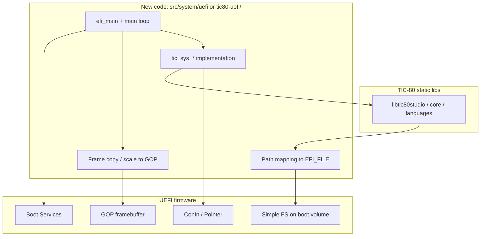

# TIC-80 as a UEFI application — port approach

This document describes how to adapt **[TIC-80](https://github.com/nesbox/TIC-80)** (a fantasy console / IDE) to run as an **x86_64 UEFI** application, using this repo’s **gnu-efi + PE32+** stack (`uefi-app/`, `BUILD_SYSTEM.md`) as the build and boot model. It is analogous in *role* to the upstream **[bare-metal Raspberry Pi](https://github.com/nesbox/TIC-80/blob/main/build/baremetalpi/README.md)** port, which uses **Circle** instead of a general-purpose OS—but the **platform APIs and boot flow differ**, so the implementation is not a line-for-line port.

Upstream references:

- [Raspberry Pi bare-metal README](https://github.com/nesbox/TIC-80/blob/main/build/baremetalpi/README.md) — Circle + `circle-stdlib`, static `tic80studio`, kernel image on SD card.
- Local clone (if present): `../projects/TIC-80/build/baremetalpi/` — `toolchain.cmake`, `Makefile`, `src/system/baremetalpi/`.

---

## What the bare-metal Pi port actually does

Understanding this is the template for “where to plug in” on UEFI:

1. **CMake** cross-compiles the TIC-80 **static libraries** (core, studio, language runtimes, etc.) with `BUILD_SDL=OFF` and defines such as **`BAREMETALPI`** and **`__circle__`** (`build/baremetalpi/toolchain.cmake`).
2. A **small platform layer** under `src/system/baremetalpi/` implements **`tic_sys_*`** (clipboard, timers, fullscreen stubs, etc.) and bridges **input** (Circle USB keyboard / mouse / gamepads) into **`tic80_input`**.
3. **Video**: the TIC frame buffer is copied into the Circle display path (`screenCopy` in `kernel.cpp` uses the console’s linear buffer).
4. **Filesystem**: `fs.c` uses **`#if defined(BAREMETALPI)`** branches and **FatFS** (`ff.h`) from Circle add-ons instead of POSIX `dirent` / `stat`.
5. A **top-level Makefile** links the prebuilt `libtic80*.a` archives with **Circle** and **newlib** into a **kernel image** (`kernel8-32.img`), not an ELF UEFI binary.

The UEFI port keeps steps **1–4** in spirit (static libs + platform glue + conditional `fs.c`), but replaces Circle with **EFI Boot Services / GOP / Simple File System / ConIn**.

---

## Mapping: Circle bare metal → UEFI

| Concern | Bare-metal Pi (Circle) | UEFI (this stack) |
|--------|-------------------------|-------------------|
| **Entry** | Circle `main` → `CKernel::Run` | `efi_main` / `UefiMain` (`InitializeLib`, then app loop) |
| **CPU / ABI** | `arm-none-eabi`, hard-float | **x86_64**, MS ABI for PE32+, per `BUILD_SYSTEM.md` |
| **Framebuffer** | BCM framebuffer via Circle | **GOP** (`EFI_GRAPHICS_OUTPUT_PROTOCOL`), BGRA or pixel mode negotiation |
| **Scan-out** | `memcpy` into screen buffer | **Blt** or direct writes (see `GRAPHICS_DEBUG.md` — some firmwares are picky; test OVMF + hardware) |
| **Keyboard / pointer** | USB stack in Circle | **`EFI_SIMPLE_TEXT_INPUT_PROTOCOL`** first; **Simple Pointer** if you need mouse; gamepads are **non-trivial** (often absent in firmware) |
| **Timers** | `CTimer::GetTicks`, `HZ` | **`gBS->Stall`**, **`SetTimer`** + events, or arch-specific counter if you expose one |
| **“Wall clock” / `time()`** | newlib + Circle | Often **stub** or map to **RTC** via EFI if needed; many subsystems use **`MINIZ_NO_TIME`**-style defines already |
| **Storage** | FatFS on SD (Circle) | **FAT on the loaded image’s device** via `EFI_SIMPLE_FILE_SYSTEM_PROTOCOL` + `EFI_FILE` (same volume as `TIC80.efi` on the ESP) |
| **C library** | newlib + `nosys` | **Minimal libc** or carefully stubbed **newlib**; no POSIX kernel underneath |
| **C++** | g++ with Circle | **Supported but careful**: link C++ runtime / exceptions / RTTI per your policy; gnu-efi samples are often **C**—you may need a **C++ entry** and linker script compatible with PE32+ |

---

## Recommended architecture (high level)

1. **Introduce a compile flag** (e.g. **`TIC80_UEFI`** or **`TIC_EFI`**) parallel to **`BAREMETALPI`**: disable SDL, enable static linking, and gate any filesystem or OS-specific code in `fs.c`, `studio.c`, etc.
2. **Add `src/system/uefi/`** (name TBD) that mirrors the *responsibilities* of `baremetalpi/kernel.cpp` + helpers: **`tic_sys_*`**, input polling, and one place that calls the studio tick / render pipeline.
3. **Reuse the existing CMake “no SDL” path** by extending `CMakeLists.txt` with `if(BAREMETALPI OR TIC80_UEFI)`-style options and a **`build/uefi/toolchain.cmake`** for **x86_64** with flags compatible with your **static libs** (no Red Zone if mixing with EFI conventions, PIC, etc.—align with `uefi-app/Makefile` and gnu-efi docs).
4. **Final link** does **not** use the Pi kernel Makefile. Instead, produce **`TIC80.efi`** using the same **ld + objcopy** pattern as `uefi-app`: **`--target efi-app-x86_64`**, preserve **`.reloc`**, validate PE32+ (`BUILD_SYSTEM.md`).

---

## Phased implementation

### Phase 0 — Build spike (no rendering)

- Cross-compile **core + minimal surface** of the engine with **`TIC80_UEFI`** and link a **dummy** `efi_main` that only prints to **`ConOut`** and returns.
- Goal: prove **CMake + toolchain + gnu-efi link** before touching GOP or TIC.

### Phase 1 — Graphics path

- Locate the **final ARGB/RGBA** buffer that bare metal copies in `screenCopy` (same dimensions / padding constants as **`TIC80_*`** macros).
- Implement **upload to GOP**: naive **1:1** if resolution allows; otherwise **nearest-neighbor scale** into an off-screen buffer then **Blt** (or firmware-safe copy path from `GRAPHICS_DEBUG.md`).
- Leave input as “no keys” or fixed test pattern.

### Phase 2 — Input

- Map **ConIn** scan codes / Unicode to **`tic80_input`** (reuse ideas from `baremetalpi/keycodes.h` and `inputToTic()`, adapted to EFI key reports).
- **Mouse**: optional via **Simple Pointer**; many TIC-80 studio features expect pointer + keyboard.

### Phase 3 — Filesystem

- Implement **`tic_fs`** operations for **`TIC80_UEFI`** using **`EFI_FILE`** (directory iteration with `EFI_FILE_INFO`, read/write aligned with existing cart save/load).
- Decide a **root folder** on the ESP (e.g. `\tic80\` next to the binary), similar to the Pi README’s `tic80` folder on the SD card.

### Phase 4 — Full studio / polish

- Match **feature set** of bare-metal Pi where feasible (clipboard can be in-memory only; **URLs / shell open** remain stubs like Pi).
- Performance: batch blits, optional frame limiter using **`Stall`**.
- **Size & memory**: static TIC-80 + all language VMs is **large**; validate **ESP free space** and **runtime pool** usage early.

### Optional: player-only MVP

Upstream can build **players** vs **full studio**. A **player-only** EFI binary may be far smaller and simpler for a first ship; full **studio** matches the Pi “tic80studio” experience but increases risk (C++ surface, editors, more FS traffic).

---

## Major risks and mitigations

| Risk | Mitigation |
|------|------------|
| **C++ + EFI link** | Keep EFI entry small; link **libc++** or build with **-fno-exceptions** where possible; follow one known-good gnu-efi + C++ example or keep glue in **C** calling into static libs. |
| **Firmware graphics quirks** | Follow **`GRAPHICS_DEBUG.md`**; test **OVMF** and one real machine; prefer **Blt** if direct GOP writes fail. |
| **No multi-threading** | TIC-80 studio may assume threads on desktop; verify **`BAREMETALPI`**-style constraints already apply. |
| **Binary size** | Strip debug; split **player** vs **studio**; lazy-load language VMs if upstream supports toggles. |
| **Time / RNG** | Reuse **`tic_sys_preseed`** patterns from `baremetalpi/kernel.cpp`; map counters to **`gBS->Stall`** or timer events. |

---

## Repo layout suggestion

Keeping TIC-80 upstream clean is ideal:

- **Preferred**: fork / branch of `TIC-80` with `build/uefi/` and `src/system/uefi/`, plus small **`#ifdef TIC80_UEFI`** blocks in `fs.c` mirroring **`BAREMETALPI`**.
- **This repo (`typewrite_os`)**: stays the reference for **EFI build hygiene** (`uefi-app/Makefile`, `start-qemu.sh`, `BUILD_SYSTEM.md`) and can host a **git submodule** or documented path to the TIC-80 tree (e.g. `../projects/TIC-80`).

---

## References in this repository

- **`BUILD_SYSTEM.md`** — PE32+, `objcopy`, linker flags, QEMU.
- **`GRAPHICS_DEBUG.md`** — GOP pitfalls (pitch, Blt vs direct).
- **`uefi-app/`** — Minimal working **gnu-efi** app pattern.
- **`uefi-vi/`** — FAT file access from EFI without GOP (for FS patterns only).

---

## Summary

The **bare-metal Pi** port proves TIC-80 can run **without SDL** behind a **thin `tic_sys_*` + video copy + FatFS** layer. A **UEFI** port is the same *software layering*, but the **OS substitute** is **EDK2-style protocols** (GOP, ConIn, Simple FS) and the **artifact** is **`TIC80.efi`**, built like **`Typewriter.efi`**, not a kernel **`kernel8-32.img`**. Start with a **build spike**, then **GOP blit**, then **input**, then **FAT**, and only then chase **full studio** parity.

---

## Implementation status (Typewrite OS + TIC-80 tree)

**Done**

- **`tic80-uefi/`** — builds **`TIC80.efi`** with gnu-efi: banner, GOP info, **`Blt`** rectangle, wait for key. Same linker/objcopy rules as `uefi-app/`.
- **TIC-80 CMake** — **`option(TIC80_UEFI ...)`** forces static libs and SDL off; **`add_compile_definitions(TIC80_UEFI=1)`**; **`cmake/uefi.cmake`**; **`include/tic80_config.h`**, **`studio.h`**, **naett / zip / quickjs / scheme** adjusted like bare-metal where needed.
- **`src/system/uefi/README.md`** — placeholder for future `tic_sys_*` + FS glue.

**Next**

- **`git submodule update --init --recursive`** in TIC-80 (vendor `zip`, `libpng`, etc. must be populated) before **`cmake -DTIC80_UEFI=ON`** succeeds.
- Implement **EFI `malloc` / file** strategy, then **`fs.c`** paths for **`TIC80_UEFI`**, then link **`libtic80studio.a`** (and deps) in **`tic80-uefi/Makefile`**.
