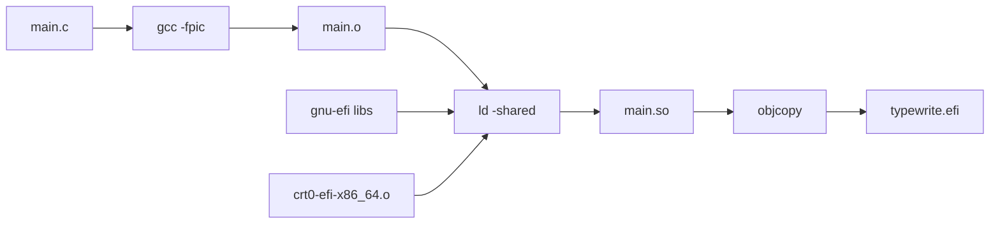

# Typewrite OS - UEFI App Experiment

## Overview

This branch (`uefi-app-experiment`) explores making Typewrite a native UEFI application instead of a Linux-based OS.

## Architecture


## Build Flow



## Current Status

### Accomplished

1. **Build Environment Setup**
   - Installed gnu-efi and libefivar-dev
   - Created working Makefile for building UEFI apps
   - QEMU with OVMF firmware ready for testing

2. **Hello World App**
   - Created `main.c` with basic UEFI app structure
   - Successfully compiles to ELF shared object
   - Successfully converts to PE/COFF format (.efi)
   - File is recognized as valid PE x86-64 executable

3. **Build Process**
   ```bash
   cd uefi-app
   make          # Builds typewrite.efi
   make run     # Runs in QEMU
   ```

### Current Issue

The UEFI shell reports "Unsupported format" when trying to run the .efi file. This could be due to:

1. **PE Header issues** - Subsystem not set correctly to UEFI application (10)
2. **Section issues** - Missing required sections in the PE file
3. **QEMU FAT filesystem** - May need proper EFI System Partition (ESP) format

### Build Files

- `Makefile` - Build system
- `main.c` - Hello world UEFI app
- `main_minimal.c` - Alternative minimal version (not built yet)
- `fs/` - FAT filesystem for QEMU testing

## Technical Notes

### Key objcopy flags for UEFI:
```
objcopy -j .text -j .sdata -j .data -j .rodata -j .dynamic -j .dynsym \
    -j .rel -j .rela -j .reloc --target=efi-app-x86_64 input.so output.efi
```

- `--target=efi-app-x86_64` sets correct PE format (translates to pei-x86-64)
- `--subsystem=10` should set UEFI application type

### UEFI Subsystem IDs:
- 10 = EFI_APPLICATION
- 11 = EFI_BOOT_SERVICE_DRIVER
- 12 = EFI_RUNTIME_DRIVER

## Next Steps

1. Fix the "Unsupported format" error
2. Add graphics/framebuffer support
3. Implement Typewrite's core typewriter functionality
4. Add file system access for document storage

## Resources

- [Rod Smith's EFI Programming Guide](http://www.rodsbooks.com/efi-programming/)
- [OSDev Wiki - GNU-EFI](https://wiki.osdev.org/GNU-EFI)
- [GNU-EFI GitHub](https://github.com/pbatard/gnu-efi)
