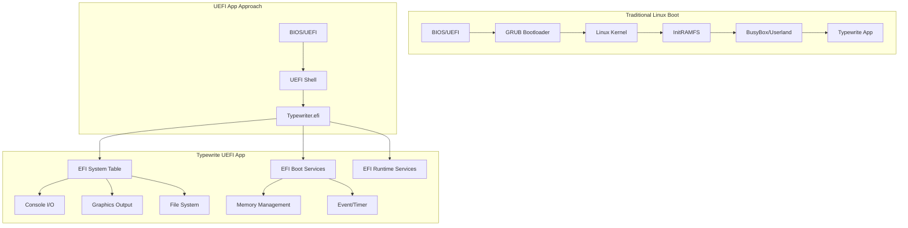

# Typewrite OS — UEFI application

Native **UEFI** build of Typewrite: boots without Linux, talks to **GOP**, **ConIn**, and firmware services via gnu-efi.

> **Build troubleshooting (PE32+, objcopy):** see [`../BUILD_SYSTEM.md`](../BUILD_SYSTEM.md).  
> **Framebuffer / hardware drawing issues:** see [`../GRAPHICS_DEBUG.md`](../GRAPHICS_DEBUG.md).  
> **Repo-wide context:** see [`../AGENTS.md`](../AGENTS.md).

## Architecture



## Build flow


## Build

```bash
cd uefi-app
make          # builds Typewriter.efi
make clean    # remove objects and .efi
```

**gnu-efi location:** `Makefile` sets `EFIDIR` (default points at a local clone). Override if needed.

For QEMU, run [`../start-qemu.sh`](../start-qemu.sh) from the repo root (it copies the freshly built `Typewriter.efi` into `fs/`). For USB/ESP, use [`../install-uefi-app.sh`](../install-uefi-app.sh).

## Current status

### Working

- **Valid PE32+** UEFI application (firmware loads it; prior “Unsupported format” came from bad `objcopy`/link — fixed per `BUILD_SYSTEM.md`).
- **QEMU + OVMF** with FAT payload under `fs/` (e.g. `startup.nsh`).
- **GOP**: mode set, framebuffer base/pitch; large region fills verified on QEMU and some real hardware.
- **Virgil / Helvetica** text: proportional bitmap stride matches `fonts/convert_font.py`; redraw coalescing when **`Doc.Modified`** (see [`../GRAPHICS_DEBUG.md`](../GRAPHICS_DEBUG.md) for pitch / framebuffer notes).

### Open

- Retest **raw framebuffer** behavior on picky hardware; consider GOP **`Blt()`** if needed.
- Feature growth toward the behavior described in [`../FEATURES.md`](../FEATURES.md) (save/load, typewriter rules) — implemented incrementally in `main.c`.

## Keys (in the graphical editor)

| Key | Action |
|-----|--------|
| **F1** | Toggle on-screen **help** |
| **F2** | **Cycle font:** Virgil → Helvetica → simple 5×8 |
| **F3** / **F6** | Increase / decrease **font scale** (1–6: glyph size, advances, proportional line step; text wraps to the next line at the margins) |
| **F4** | Cycle background color |
| **F5** | Toggle cursor |
| **ESC** | Close help if open; otherwise **exit** |

## Source layout

| File | Role |
|------|------|
| `Makefile` | `TARGET = Typewriter.efi`, gnu-efi link + objcopy |
| `main.c` | Application entry, GOP, fonts, input loop |
| `main_minimal.c` | Alternate minimal sketch (not the default `make` target) |
| `virgil.h`, `helvetica.h` | Font bitmap data |
| `fs/` | FAT contents for QEMU (copy `Typewriter.efi`, `startup.nsh`, etc.) |

## Technical notes

### objcopy (summary)

Include `.text`, `.sdata`, `.data`, `.dynamic`, `.rodata`, `.rel`, `.rela`, **`.reloc`**, and use:

`--target efi-app-x86_64`

(not `-O efi-app-x86_64` — see `BUILD_SYSTEM.md`).

### UEFI subsystem IDs

- 10 = EFI_APPLICATION  
- 11 = EFI_BOOT_SERVICE_DRIVER  
- 12 = EFI_RUNTIME_DRIVER  

## Resources

- [Rod Smith's EFI Programming Guide](http://www.rodsbooks.com/efi-programming/)
- [OSDev Wiki — GNU-EFI](https://wiki.osdev.org/GNU-EFI)
- [GNU-EFI (GitHub)](https://github.com/pbatard/gnu-efi)
